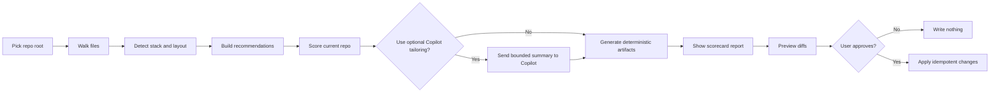
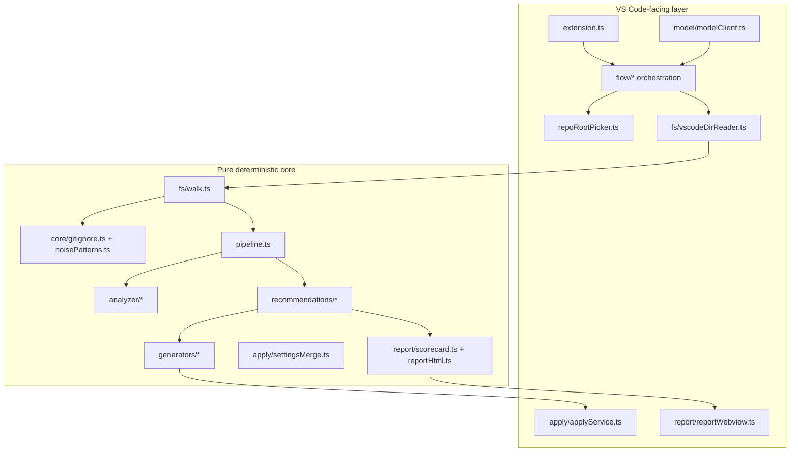
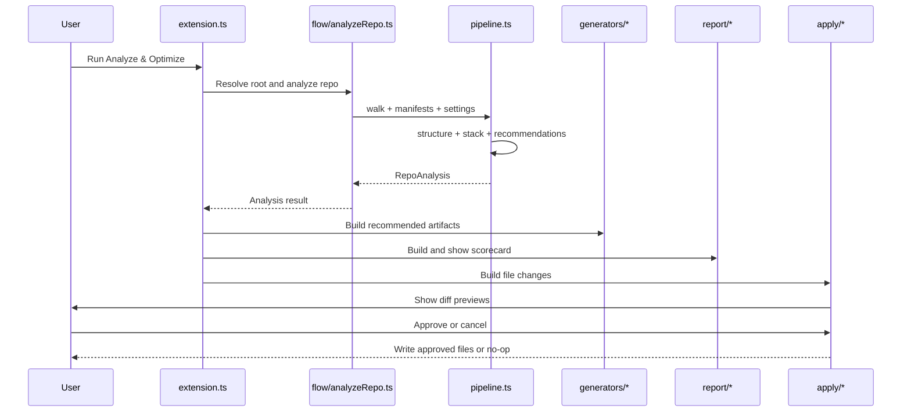
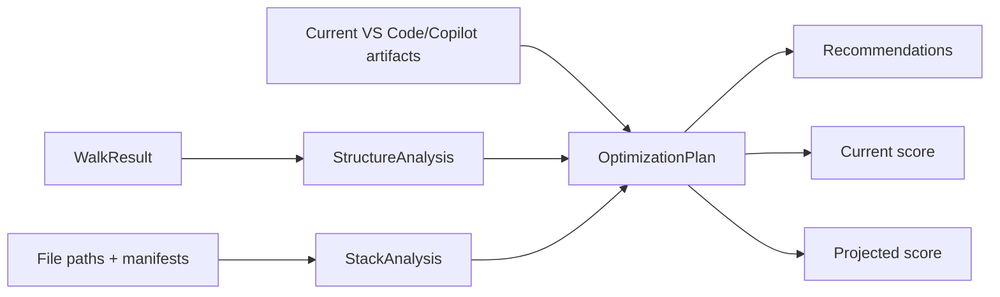
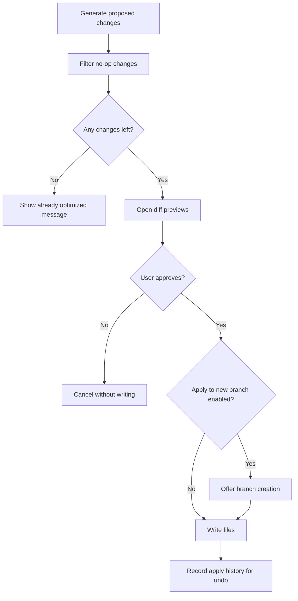

# Copilot Token-Efficiency Optimizer (TokenMin)

TokenMin is a VS Code extension that prepares a repository so **Copilot agent
mode sees less noise, better guidance, and a smaller tool surface**. The goal is
simple: make agent sessions more accurate while lowering the amount of context
and tool metadata that has to be sent to the model.

It does this by analyzing the repo, recommending token-saving changes, showing a
reviewable diff, and then applying only the changes the user explicitly approves.
TokenMin produces configuration and repo-structure artifacts that Copilot agent
mode can consume. It does **not** drive Copilot's agent loop or secretly send work
to Copilot.

## ELI5

Imagine Copilot agent mode is a helper trying to fix something in a huge room.
If the room is full of boxes of generated files, dependency folders, build
outputs, long instructions, and too many tools, the helper wastes time looking at
stuff that does not matter.

TokenMin tidies the room before the helper starts:

- It hides obvious clutter such as `node_modules`, build folders, caches, and
  lockfiles from search and file browsing where appropriate.
- It writes a short note that explains what the project is and how to work in it.
- It can add smaller, scoped notes that only load for matching files.
- It creates a lightweight architecture map so agents do less wandering.
- It defines focused Plan and Implement agents with smaller tool sets.
- It shows a before/after efficiency score so the user can see what changed.

## What The Extension Does

The main command is **Token Optimizer: Analyze & Optimize Repo**
(`tokenmin.analyzeAndOptimize`). It runs a guided pipeline:



There are also report-only and reopen-report commands:

- **Token Optimizer: Analyze Repo (report only)** (`tokenmin.analyzeOnly`)
- **Token Optimizer: Show Efficiency Report** (`tokenmin.showReport`)
- **Token Optimizer: Undo Last Applied Changes** (`tokenmin.undoLast`)

## Optimizations Applied For Copilot Agent Mode

### 1. Exclude Low-Signal Paths

TokenMin recommends `search.exclude` and `files.exclude` entries for directories
and files that are usually harmful to agent context quality:

- Dependency folders: `node_modules`, `bower_components`, `Pods`
- Virtual environments and caches: `.venv`, `venv`, `__pycache__`, `.pytest_cache`
- Framework/build caches: `.next`, `.nuxt`, `.svelte-kit`, `.turbo`, `.gradle`
- Build output: `dist`, `build`, `out`, `target`, `coverage`
- Lockfiles in balanced/aggressive modes: `package-lock.json`, `pnpm-lock.yaml`,
  `yarn.lock`, `Cargo.lock`, and similar files

This reduces search results, file listings, and indexed context that would
otherwise distract the agent. Paths already excluded by `.gitignore` are skipped
because Copilot already honors `.gitignore`; adding them again would be noisy and
less honest.

### 2. Add Concise Always-On Instructions

If `.github/copilot-instructions.md` is missing, TokenMin can generate a short
repo-specific file with:

- Detected stack and language information
- Top-level layout or monorepo modules
- Project conventions inferred from the stack
- Test/build hints
- A reminder to prefer local, targeted reads over broad searches

The generator has size guardrails so the instructions remain useful instead of
becoming another large context blob.

### 3. Add Scoped Instructions

For polyglot projects or monorepos, TokenMin can generate scoped instruction
files under `.github/instructions/*.instructions.md` with `applyTo` globs. This
lets Copilot load guidance only when it matches the file being edited.

Example idea:

```md
---
applyTo: "packages/api/**/*.ts"
---

Use the API package conventions and run the API test target before finishing.
```

Scoped guidance is cheaper than putting every convention into one always-loaded
instruction file.

### 4. Add An Architecture Map

For larger repos, TokenMin can generate or recommend an `ARCHITECTURE.md` file.
The purpose is not to document every class. It gives agents and humans a short
map of where things live so they can start in the right place.

### 5. Split Planning From Implementation

TokenMin can add two Copilot custom agents:

- `.github/agents/plan.agent.md`: read-only, reasoning-oriented, used to explore
  and produce a concrete plan.
- `.github/agents/implement.agent.md`: edit/run oriented, used to execute an
  approved plan with a cheaper model preference.

This reduces waste because expensive reasoning is used briefly for planning,
while implementation can run with a more economical model and a focused tool set.

### 6. Trim Tool Definitions

Agent mode includes tool definitions in requests. More tools means more tokens,
and broad tools can produce large outputs. TokenMin generates lean tool sets so
each agent gets only what it needs.

Plan tools are read-oriented. Implement tools include editing and command-running
tools. The report compares the lean tool count against a typical broader agent
tool surface.

### 7. Check Semantic Index Health

TokenMin detects whether the repo appears to have a GitHub remote. A GitHub
remote usually means Copilot can use a remote semantic index. Without one,
Copilot may rely on local indexing or have weaker retrieval. The report includes
index-related guidance and deep links where available.

### 8. Show An Efficiency Scorecard

The scorecard gives a 0-100 score, a projected after-apply score, and proxy
metrics such as:

- Source files considered after pruning
- Noisy paths excluded
- Directories already handled by `.gitignore`
- Estimated instruction tokens
- Lean versus typical tool count
- Semantic index source

Precise live Copilot token metering is not exposed to extensions, so TokenMin is
honest: it uses measurable proxies and links to Copilot's own cost/debug tools.

## Architecture Overview

TokenMin separates pure analysis code from VS Code integration. That keeps most
of the system unit-testable without launching an editor host.



## Main Runtime Flow

At runtime, `src/extension.ts` registers commands, owns the status bar entry,
and calls `runAnalyze()`. The orchestration then delegates to smaller modules:



## Key Modules

| Area | Files | Responsibility |
| --- | --- | --- |
| Extension entry | `src/extension.ts` | Registers commands, status bar, report panel, and apply flow. |
| Repo root | `src/repoRoot.ts`, `src/repoRootPicker.ts` | Resolves which workspace folder to analyze. |
| Walking | `src/fs/walk.ts`, `src/fs/vscodeDirReader.ts` | Traverses files with a `DirReader` abstraction and respects `.gitignore`. |
| Noise rules | `src/core/noisePatterns.ts` | Defines dependency/build/cache/lockfile patterns and risk tiers. |
| Analysis | `src/analyzer/structure.ts`, `src/analyzer/stack.ts` | Summarizes repo size/noise and detects stack/layout/index source. |
| Pipeline | `src/pipeline.ts` | Pure end-to-end analysis coordinator. |
| Recommendations | `src/recommendations/engine.ts` | Builds optimization recommendations and before/after scores. |
| Generators | `src/generators/*` | Produces Copilot instructions, scoped instructions, agents, tool sets, prompts, and architecture docs. |
| Model tailoring | `src/model/*` | Builds bounded prompts and optionally asks Copilot to tailor instructions after consent. |
| Apply | `src/apply/*` | Preserves settings formatting, shows diffs, applies approved changes, and records undo history. |
| Report | `src/report/*` | Renders the scorecard webview and text reports. |

## Recommendation Engine

The deterministic engine turns repo facts into concrete recommendations.



Recommendation priority is based on practical token impact:

- **High**: missing exclusions or always-on instructions.
- **Medium**: architecture docs, scoped instructions, custom agents, lean tool
  sets, or missing index setup.
- **Low**: workflow habits such as plan/implement sessions and context
  compaction.

## Safety Model

TokenMin is designed to be reviewable and repeatable.



Safety properties:

- Preview before apply is mandatory.
- Re-running is idempotent.
- Existing JSONC settings comments and formatting are preserved.
- `.gitignore` exclusions are respected instead of duplicated.
- Optional model tailoring is consent-gated and bounded.
- Applying to a new branch can be offered with `tokenmin.applyToNewBranch`.

## Settings

| Setting | Default | Description |
| --- | --- | --- |
| `tokenmin.exclusionAggressiveness` | `balanced` | Controls exclusion tiers: `conservative`, `balanced`, or `aggressive`. |
| `tokenmin.modelFamilyPreference` | `gpt-4o` | Preferred Copilot model family for optional tailoring and the implement agent template. |
| `tokenmin.applyToNewBranch` | `false` | Offers to create a branch before applying changes. |
| `tokenmin.maxFilesScanned` | `20000` | Caps the file walk for large repositories. |

## Build, Test, And Package

```sh
npm install
npm run compile        # type-check + bundle dist/extension.js
npm test               # unit + integration tests, no editor host required
npm run verify:bundle  # load bundled extension with a mocked vscode API
npm run vsce:package   # produce tokenmin.vsix
```

Install the VSIX through **Extensions -> ... -> Install from VSIX...**, or run:

```sh
code --install-extension tokenmin.vsix
```

## How To Use

1. Install or launch the extension.
2. Open the repository you want to optimize.
3. Run **Token Optimizer: Analyze Repo (report only)** to inspect the score and
   recommendations without writing files.
4. Run **Token Optimizer: Analyze & Optimize Repo** when ready to preview and
   apply changes.
5. Review every diff tab before approving.
6. Reopen the latest report with **Token Optimizer: Show Efficiency Report**.

## What Can Be Built On Top

TokenMin already has a clean split between VS Code adapters and pure engines,
which makes it a good base for additional features.

### 1. Live Chat Participant

Add a Copilot chat participant such as `@tokenmin` that can answer questions
about the current score, explain recommendations, or generate a plan without
opening the full optimize flow.

Possible commands:

- `@tokenmin explain score`
- `@tokenmin why exclude dist`
- `@tokenmin optimize plan only`

### 2. Language Model Tool

Expose TokenMin's deterministic analyzer as a Language Model Tool. Copilot could
call it during an agent session to retrieve a compact repo summary instead of
performing repeated broad searches.

### 3. Real Usage Importers

The scorecard already supports defensive chat-export estimation. This can grow
into importers for multiple export formats, trend charts, and before/after
comparisons across sessions.

### 4. Workspace Policy Packs

Teams could define policy packs for preferred exclusions, instruction limits,
allowed tools, and model choices. TokenMin would compare a repo against the pack
and generate compliant artifacts.

### 5. Monorepo-Aware Optimization

The stack detector already identifies modules. Future work could generate module
scorecards, package-specific prompts, and per-package tool sets.

### 6. CI Check Mode

Add a non-interactive command that fails CI when instruction files get too large,
generated folders are not excluded, or required agent files drift from policy.

### 7. Deeper Index Diagnostics

The current report detects likely index source. A future version could surface
index age, stale files, local-vs-remote status, and specific remediation steps.

### 8. Safer Artifact Merging

Generated Markdown files are currently replaced when approved. Future merging
could preserve user-authored sections with markers, similar to how settings JSONC
is merged format-safely today.

### 9. Cost Simulation

TokenMin could estimate the token impact of a proposed tool set, instruction
file, or exclusion change before applying it, then compare multiple strategies.

### 10. Organization Dashboard

For many repos, TokenMin could export normalized scorecards and aggregate them
into a dashboard showing which repos are ready for efficient Copilot agent use.

## Limitations

- Precise live Copilot token metering is not exposed to extensions.
- Some report deep links depend on the installed Copilot version.
- The optional Copilot tailoring pass uses the user's Copilot quota and only runs
  after explicit consent.
- TokenMin optimizes the repository environment for Copilot agent mode; it does
  not control Copilot's internal planning, retrieval, or model routing.

## License

MIT - see the `LICENSE` file.
